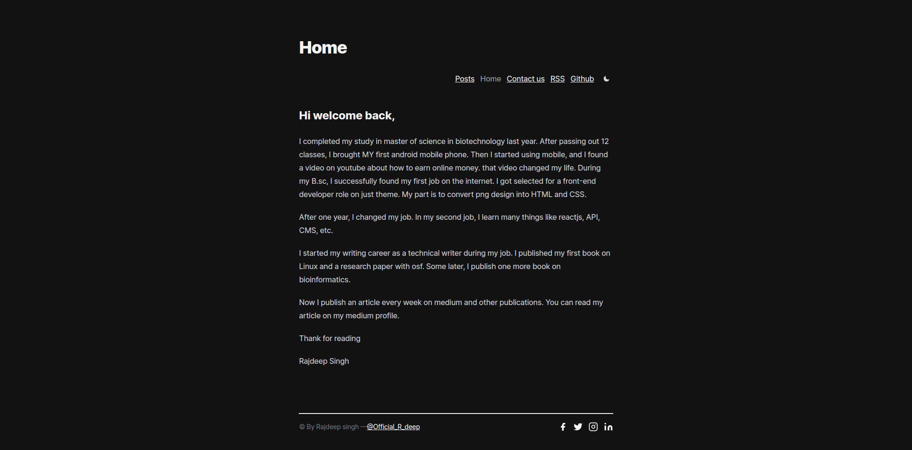
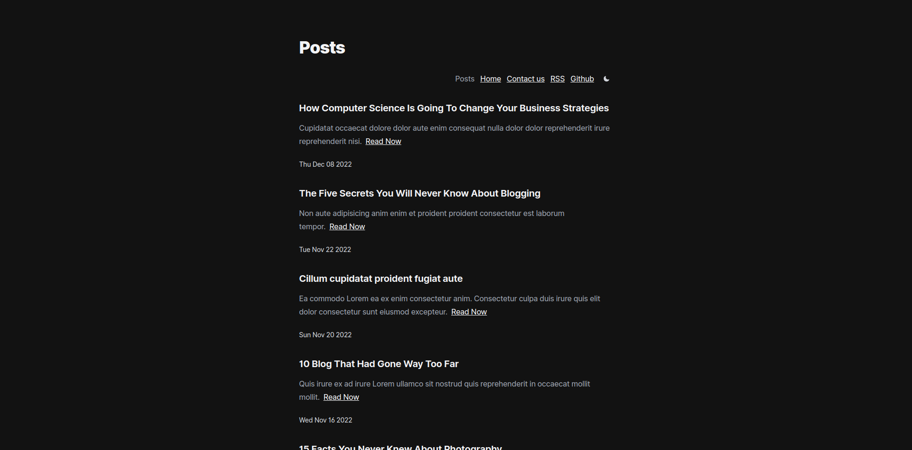
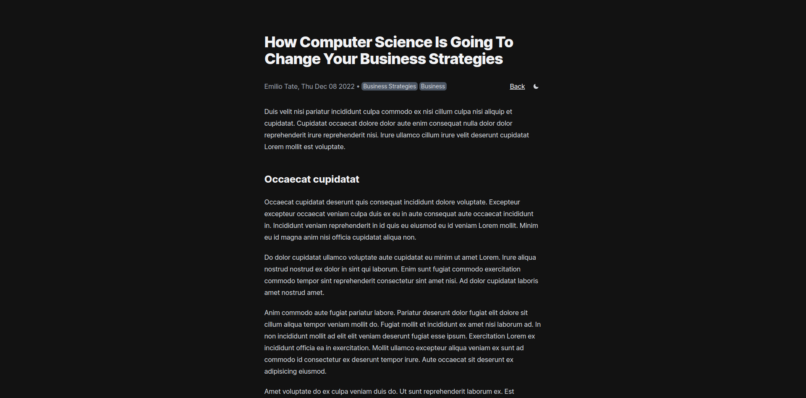

# Nextra Blog Theme

This portfolio BLOG is built with **Next.js** and [Nextra](https://nextra.vercel.app/). I used the nextra blog theme to built this blog.

## Feature

* Home page
* Author support
* Tags support
* Newsletter support
* Comment support
* Syntax ( code ) Highlighting
* Header,postFooter and footer customization
* SEO and Sitemap support.


### Home



### Posts page



### Reading Page




## Configuration

1. Update your footer, navbar, comments and postFooter in `theme.config.js`.
2. Update your name and site URL for the RSS feed in `scripts/gen-rss.js`. To change your feed run `pnpm feed or yarn feed` to create or update feed in your blog.
3. Update the meta tags in `pages/_document.js`.
4. Update the posts inside `pages/posts/*.md` with your own content.


### Note 

> Remove the basePath `basePath: '/nextra-blog'` in `next.config.js`. Other wise you see a blank screen on `localhost:3000`.

## How to use

```bash

# Step 1
git clone https://github.com/frontendweb3/nextra-blog.git

# Step 2
cd nextra-blog


# Step 3
pnpm install 

# or 

yarn install

# Step 4
pnpm dev 

or

yarn dev

# step 5
# remove the basePath in next.config.js
basePath: '/nextra-blog',

```
